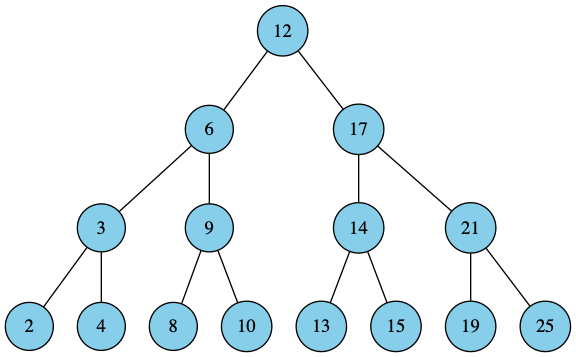
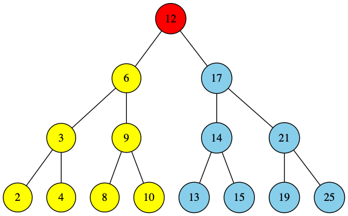
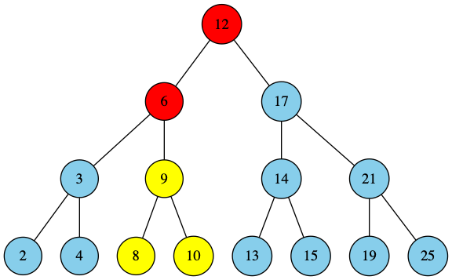

# 最优二叉搜索树


## 二叉搜索树

二叉搜索树（Binary Search Tree），（又：二叉查找树，二叉排序树）它或者是一棵空树，或者是具有下列性质的二叉树： 若它的左子树不空，则左子树上所有结点的值均小于它的根结点的值； 若它的右子树不空，则右子树上所有结点的值均大于它的根结点的值； 它的左、右子树也分别为二叉搜索树。




## 查询二叉搜索树

> 二叉查找树中最常见的操作是查找树中的某个关键字，除了基本的查询，还支持最大值、最小值、前驱和后继查询操作。

在二叉查找树中查找一个给定的关键字k的过程与二分查找很类似，根据二叉查找树在的关键字存放的特征，很容易得出查找过程：首先是关键字k与树根的关键字进行比较，如果k大比根的关键字大，则在根的右子树中查找，否则在根的左子树中查找，重复此过程，直到找到与遇到空结点为止。例如下图所示的查找关键字10的过程：（查找过程每次在左右子树中做出选择，减少一半的工作量）

### 第1步 在12的左子树查找

### 第2步 在6的右子树查找

### 第3步 在9的右子树查找

### 第4步 成功找到10


递归代码

```
TREE_SEARCH(x,k)
  if x=NULL or k=key[x]
      then return x
  if(k<key[x])
      then return TREE_SEARCH(left[x],k)
   else
      then return TREE_SEARCH(right[x],k)
      
```
非递归代码

```
ITERATIVE_TREE_SEARCH(x,k)
  while x!=NULL and k!=key[x]
      do if k<key[x]
              then x=left[x]
           else
              then x=right[x]
   return x
```

## 最优二叉搜索树

> 接着学习动态规划方法，最优二叉查找树问题。如果在二叉树中查找元素不考虑概率及查找不成功的情况下，可以采用红黑树或者平衡二叉树来搜索，这样可以在O(lgn)时间内完成。而现实生活中，查找的关键字是有一定的概率的，就是说有的关键字可能经常被搜索，而有的很少被搜索，而且搜索的关键字可能不存在，为此需要根据关键字出现的概率构建一个二叉树。比如中文输入法字库中各词条（单字、词组等）的先验概率，针对用户习惯可以自动调整词频——所谓动态调频、高频先现原则，以减少用户翻查次数，使得经常用的词汇被放置在前面，这样就能有效地加快查找速度。这就是最优二叉树所要解决的问题。

### 问题描述
给定一个由n个互异的关键字组成的有序序列K={k1<k2<k3<,……,<kn}和它们被查询的概率P={p1,p2,p3,……,pn}，要求构造一棵二叉查找树T，使得查询所有元素的总的代价最小。对于一个搜索树，当搜索的元素在树内时，表示搜索成功。当不在树内时，表示搜索失败，用一个“虚叶子节点”来标示搜索失败的情况，因此需要n+1个虚叶子节点{d0<d1<……<dn}，对于应di的概率序列是Q={q0,q1,……,qn}。其中d0表示搜索元素小于k1的失败结果，dn表示搜索元素大于kn的失败情况。di（0<i<n）表示搜索节点在ki和k(i+1)之间时的失败情况。因此有如下公式：


　　由每个关键字和每个虚拟键被搜索的概率，可以确定在一棵给定的二叉查找树T内一次搜索的期望代价。设一次搜索的实际代价为检查的节点个数，即在T内搜索所发现的节点的深度加上1。所以在T内一次搜索的期望代价为：


需要注意的是：一棵最优二叉查找树不一定是一棵整体高度最小的树，也不一定总是把最大概率的关键字放在根部。

对于一个 n=5 的关键字集合及如下的搜索概率，构造两棵二叉搜索树:


i | 0 | 1 | 2 | 3 | 4 | 5 
:-: | :-: | :-: | :-: | :-: | :-: | :-:
p |   | 0.15 | 0.10 | 0.05 | 0.10 | 0.20 |
q | 0.05 | 0.10 | 0.05 | 0.05 | 0.05 | 0.10 |


我们逐点计算a的期望搜索代价

结点 | 深度 | 概率 | 贡献(平均搜索次数) 
:-: | :-: | :-: | :-: 
k1 | 1 | 0.15 | 0.30 |
k2 | 0 | 0.10 | 0.10 |
k3 | 2 | 0.05 | 0.15 |
k4 | 1 | 0.10 | 0.20 |
k5 | 2 | 0.20 | 0.60 |
d0 | 2 | 0.05 | 0.15 |
d1 | 2 | 0.10 | 0.30 |
d2 | 3 | 0.05 | 0.20 |
d3 | 3 | 0.05 | 0.20 |
d4 | 3 | 0.05 | 0.20 |
d5 | 3 | 0.10 | 0.40 |
合计 | | | 2.80 |

b的期望搜索代价

结点 | 深度 | 概率 | 贡献(平均搜索次数) 
:-: | :-: | :-: | :-: 
k1 | 1 | 0.15 | 0.30 |
k2 | 0 | 0.10 | 0.10 |
k3 | 3 | 0.05 | 0.20 |
k4 | 2 | 0.10 | 0.30 |
k5 | 1 | 0.20 | 0.40 |
d0 | 2 | 0.05 | 0.15 |
d1 | 2 | 0.10 | 0.30 |
d2 | 4 | 0.05 | 0.25 |
d3 | 4 | 0.05 | 0.25 |
d4 | 3 | 0.05 | 0.25 |
d5 | 2 | 0.10 | 0.20 |
合计 | | | 2.75 |

### 动态规划求解过程

#### 1、最优二叉查找树的结构

为了刻画最优二叉搜索树的结构，我们从观察子树特征开始。考虑一棵二叉搜索树的任意子树。它必须包含连续关键字 k(i),...k(j)，1&lt;=i&lt;=j&lt;=n，
k(i),...k(j)，1<=i<=j<=n， 而且其叶结点必然是伪关键字 d(i−1),...,d(j)
d(i−1),...,d(j) 。

我们现在可以给出二叉搜索树问题的最优子结构：如果一棵最优二叉搜索树T有一棵包含关键字 k(i),...,k(j)
k(i),...,k(j) 的子树T’，那么T’必然是包含关键字 k(i),...,k(j)
k(i),...,k(j) 和伪关键字 d(i−1),...,d(j)
d(i−1),...,d(j) 的子问题的最优解。我们依旧用“剪切-粘贴”法来证明这一结论。如果存在子树T’’，其期望搜索代价比T’低，那么我们将T’从T中删除，将T’'粘贴到相应的位置，从而得到一颗期望搜索代价低于T的二叉搜索树，与T最优的假设矛盾。

我们需要利用最优子结构性质来证明，我们可以用子问题的最优解构造原问题的最优解。给定关键字序列k(i),...,k(j)
k(i),...,k(j)，其中某个关键字，比如说k(r)(i&lt;=r&lt;=j)
k(r)(i<=r<=j)，是这些关键字的最优子树的根结点。那么k®的左子树就包含关键字k(i),...,k(r−1)
k(i),...,k(r−1)(和伪关键字d(i−1),...,d(r−1)
d(i−1),...,d(r−1))，而右子树包含关键字k(r+1),...,k(j)
k(r+1),...,k(j)(和伪关键字d(r),...,d(j)
d(r),...,d(j))。只要我们检查所有可能的根结点k(r)(i&lt;=r&lt;=j)
k(r)(i<=r<=j)，并对每种情况分别求解包含k(i),...,k(r−1)
k(i),...,k(r−1)及包含k(r+1),...,k(j)
k(r+1),...,k(j)的最优二叉搜索树，即可保存找到原问题的最优解。

这里还有一个值得注意的细节——“空子树”。假定对于包含关键字ki,...,kj
ki,...,kj的子问题，我们选定ki
ki为根结点。根据前文论证，k(i)
k(i)的左子树包含关键字k(i),...,k(i−1)
k(i),...,k(i−1)的子问题，我们将此序列解释为不包含任何关键字。但请注意，子树仍然包含伪关键字。按照惯例，我们认为包含关键字序列k(i),...,k(i−1)
k(i),...,k(i−1)的子树不包含任何实际关键字，但包含单一伪关键字d(i−1)
d(i−1)。对称地，我们如果现在k(j)
k(j)为根结点，那么k(j)
k(j)的右子树包含关键字k(j+1),...,k(j)
k(j+1),...,k(j)——此右子树不包含任何实际关键字，但包含伪关键字d(j)
d(j)。

#### 2、一个递归解

我们已经准备好给出最优解值的递归定义。我们选取子问题域为：求解包含关键字k(i),...,k(j)
k(i),...,k(j)的最优二叉搜索树，其中i>=1，j&lt;=n
i>=1，j<=n且j>=i−1
j>=i−1(当j=i−1
j=i−1时，子树不包含实际关键字，只包含伪关键字d(i−1)
d(i−1)。定义e[i,j]
e[i,j]为包含关键字k(i),...,k(j)
k(i),...,k(j)的最优二叉搜索树中进行一次搜索的期望代价，最终，我们希望计算出e[1,n]
e[1,n]。

j=i-1的情况最为简单，由于子树只包含伪关键字d(i-1)，期望搜索代价为 e[i,i−1]=q(i−1)
e[i,i−1]=q(i−1) 。

当j>=i
j>=i时，我们需要从k(i),...,k(j)
k(i),...,k(j)中选择一个跟结点k(r)
k(r)，然后构造一棵包含关键字k(i),...,k(r−1)
k(i),...,k(r−1)的最优二叉搜索树作为其左子树，以及一棵包含关键字k(r+1),...,k(j)
k(r+1),...,k(j)的二叉搜索树作为其右子树。当一棵子树成为一个结点的子树时，期望搜索代价有何变化？由于每个结点的深度都增加了1，根据之前得出的公式:


这棵子树的期望搜索代价的增加值应为所有概率这和。对于包含关键字 k(i),...,k(j)的子树，所有概率之和为：


因此如果kr是一棵包含关键字ki，……，kj的最优子树的根，则有：


注意，w(i,j)=w(i,r−1)+p(r)+w(r+1,j)

故e[i,j]重写为：


最终的递归式如下：


#### 3、计算一棵最优二叉查找树的期望搜索代价

将e[i,j]的值保存到一个二维数组e[1..1+n,0..n]中，用root[i,j]来记录关键字ki，……，kj的子树的根，采用二维数组root[1..n,1..n]来表示。为了提高效率，防止重复计算，需要个二维数组w[1..n+1,0...n]来保存w(i,j)的值，其中w[i,j] = w[i,j-1]+pj+qj。数组给出了计算过程的伪代码：

```
OPTIMAL_BST(p,q,n)
    for i=1 to n+1    //初始化e和w的值
       do e[i,i-1] = qi-1;
          w[i,i-1] = qi-1;
     for l=1 to n
        do for i=1 to n-l+1
                  do j=i+l-1;
                       e[i,j] = MAX;
                       w[i,j] = w[i,j-1]+pj+qj;
                       for r=i to j
                               do t=e[i,r-1]+e[r+1,j]+w[i,j]
                                    if t<e[i,j]
                                         then e[i,j] = t;
                                              root[i,j] = r;
return e and root;
```

#### 4、构造一棵最优二叉查找树

根据地第三步中得到的root表，可以递推出各个子树的根，从而可以构建出一棵最优二叉查找树。从root[1,n]开始向下递推，一次找出树根，及左子树和右子树。

#### [代码链接](./code/Dynamic_Programming/OptimalBinarySearchTree/optimal_binary_search.java)