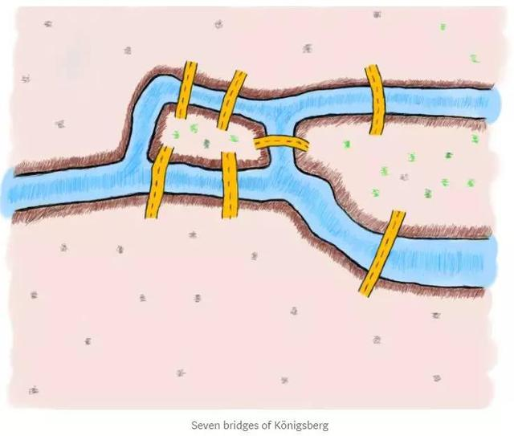
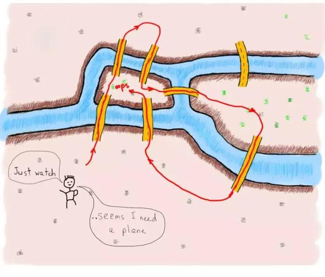
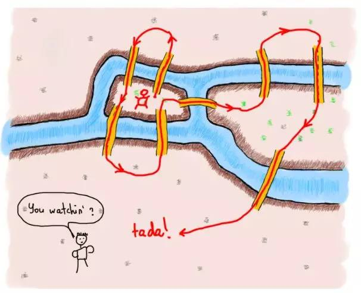
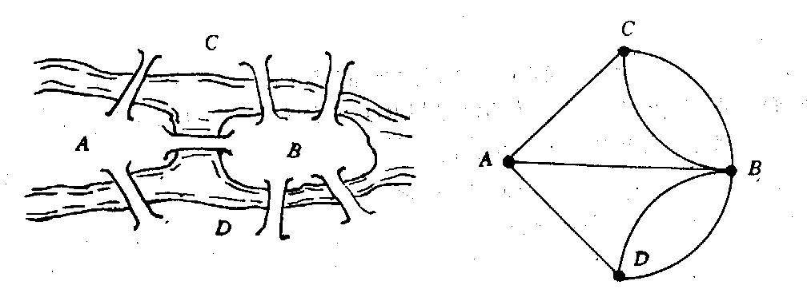
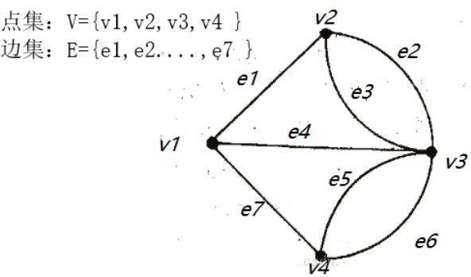

**七桥问题**

让我们首先从「柯尼斯堡（Knigsberg）的七座桥」开始。在加里宁格勒（Kaliningrad）有七座桥，连接着由普雷戈里亚（Pregolya）河分割而成的两个岛屿和两大陆地。

在 18 世纪，这里被称为柯尼斯堡，隶属普鲁士，这一区域有很多桥。当时，有一个与柯尼斯堡的桥相关的脑筋急转弯：**如何只穿过桥一次而穿过整个城市？**

去掉一座桥：

添加一座桥：

抽象模型：

如果存在奇数点，奇数点只能是0或者2。

**图（Graph）是什么？**

> 图是互连节点的集合。（ *a collection of interconnected nodes*）

图 G=(V, E) 由下列要素构成：

一组节点（也称为 vertices）V=1,…,n
一组边 E⊆V×V
如：边 (i,j) ∈ E 连接了节点 i 和 j

**图的基本术语**

节点/顶点（Node / Vertex）：V=1,…,n。

边（Edge）：连接两个节点，可为有向和无向。

阶（Order）：图G顶集V的大小称作图G的阶。

度（Degree）：一个顶点的度是指与该顶点相关联的总边数，顶点v的度记作d(v)。Total(D) = 2Total(E)

完备图（Order）：如果一个图的所有节点都有 n-1 个相邻节点，则该图是完备的（complete）。也就是说所有节点都具备所有可能的连接方式。

有向图（Order）：如果一个图的边是有顺序的配对，则该图是有向的（directed）。

出度（Out-degree）和入度（In-degree）：对有向图而言，顶点的度还可分为出度和入度，入度（in-degree）是指向 i 的边的数量，出度（out-degree）是远离 i 的边的数量。

**如何存储图？**

1、边列表（Edge List）

​			[1, 2]

​			[1, 3]

​			[2, 3]

​			...

​			[A, C]

​			[A, B]

​			[B, C]

​			...

2、邻接矩阵（Adjacency Matrix）

有向图

| \        | V1   | Ｖ2  | Ｖ3  | Ｖ4  |
| -------- | ---- | ---- | ---- | ---- |
| V1  (in) | ０   | １   | １   | ０   |
| V2  (in) | ０   | ０   | １   | 0    |
| V3  (in) | ０   | ０   | ０   | １   |
| V4  (in) | １   | ０   | ０   | 0    |

​		       0 1 1 0

A = 		 0 0 1 0

​		        0 0 0 1

​		        1 0 0 0

无向图

| \    | V1   | Ｖ2  | Ｖ3  | Ｖ4  |
| ---- | ---- | ---- | ---- | ---- |
| V1   | ０   | １   | １   | 1    |
| V2   | 1    | ０   | １   | 0    |
| V3   | 1    | 1    | ０   | １   |
| V4   | １   | ０   | 1    | 0    |

​		       0 1 1  1

A = 		 1 0 1 0

​		        1 1 0 1

​		        1 0 1 0                                                 **无向图的邻接矩阵是对称的。**

3、邻接列表（Adjacency Lists）

节点1 ：[2, 3, 4]

节点2 ：[1, 3]

节点3 ：[2, 4]

图表示时的一些扩展：

- 加权边（Weighted Edges）
- 节点/边上加标签
- 加上与节点/边相关的特征向量