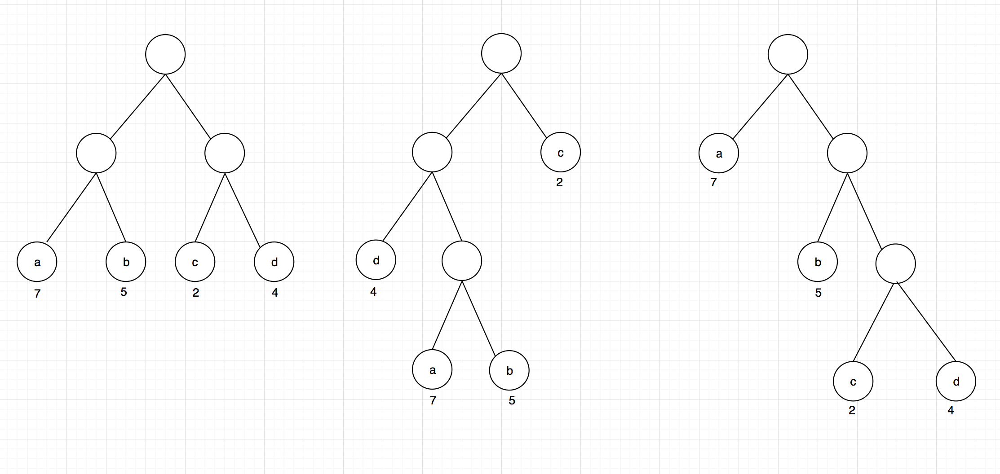
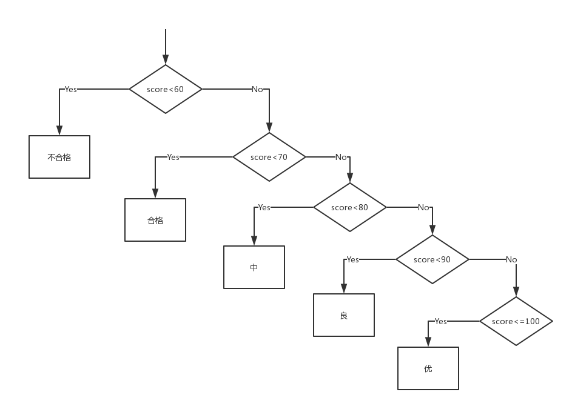
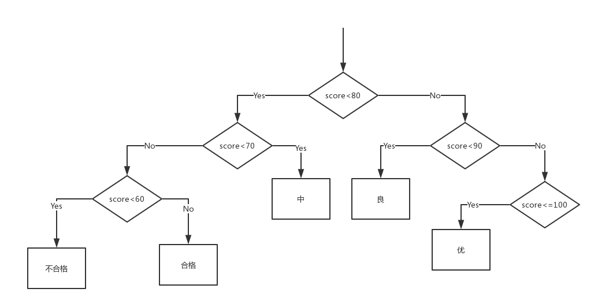

## 一、什么是哈夫曼树？
了解几个定义：

#### 1、节点之间的路径长度

在树中从一个节点到另一个节点所经历的分支，构成了这两个节点间的路径上的经过的分支数称为它的路径长度。

#### 2、树的路径长度

树的路径长度是从树的根节点到树中每一节点的路径长度之和。在节点数目相同的二叉树中，完全二叉树的路径长度最短。

#### 3、树的带权路径长度(Weighted Path Length of Tree，简记为WPL)

##### 节点的权：

在一些应用中，赋予树中节点的一个有某种意义的实数。

##### 节点的带权路径长度：

节点到树根之间的路径长度与该节点上权的乘积。

##### 树的带权路径长度 (Weighted Path Length of Tree)：

定义为树中所有叶节点的带权路径长度之和，通常记为： WPL=(W1L1+W2L2+W3L3+...+WnLn)

其中：W1 和 L1 分别表示叶节点的权值和根到节点之间的路径长度。

#### 4、哈夫曼树的定义

假设有 n 个权值[W1,W2,....WN]，构造有 n 个叶子的二叉树，每个叶子的权值是 n 个权值之一，这样的二叉树可以构造很多个，其中必有一个是带权路径长度最小的，这棵二叉树就称为最优二叉树或哈夫曼树。


 


第一棵：WPL=7*2+5*2+2*2+4*2=36
第一棵：WPL=7*3+5*3+2*1+4*2=46
第一棵：WPL=7*1+5*2+2*3+4*3=35
其中第三棵树的WPL最小，它就是哈夫曼树。

## 二、哈弗曼树为了解决什么问题？
解决「效率」问题！

例子：

比如一所高中有1000个同学进行了一次考试（总分100），现在需要将每个成绩段转换为优、良、中、合格、不合格（已经知道每个分数段多少人）。当不合格、合格这块同学比较多时效率比较高，因为大部分人只要比较一次或两次。如果中高分段人比较多那么这时候的效率就比较低了因为大部分人需要比较至少 3 次以上。当中间段人比较多时，这个比较方法效率高，大多数人只要比较一到两次，如果两端人比较多那么效率就比较低。所以，当我们知道每个分数段大概有多少人时，可以将分数段人多的放在顶端减下比较次数，少的放底端。


从最右端开始：

 


从中间开始：

 


## 三、哈夫曼树的特点是啥？

1、没有度为1的节点；

2、n个叶子节点的哈夫曼树共有2n-1个节点；

3、哈夫曼树任意非叶节点的左右树交换后仍是哈夫曼树；

## 四、如何创建哈夫曼树？

1、创建节点；

2、对节点权值升序排序；

3、取出权值最小的两个节点，生成一个新的父节点；

4、删除权值最小的两个节点，将父节点存放到列表中；

5、重复第四五步，直到剩下一个节点；

6、将最后的一个节点赋给根节点。


```java
package com.igetget.myapplication;
 
/**
 * 节点
 */
public class Node implements Comparable {
 
    private int value;
    private Node leftChild;
    private Node rightChild;
 
    public Node(int value) {
        this.value = value;
    }
 
    public int getValue() {
        return value;
    }
 
    public void setValue(int value) {
        this.value = value;
    }
 
    public Node getLeftChild() {
        return leftChild;
    }
 
    public void setLeftChild(Node leftChild) {
        this.leftChild = leftChild;
    }
 
    public Node getRightChild() {
        return rightChild;
    }
 
    public void setRightChild(Node rightChild) {
        this.rightChild = rightChild;
    }
 
    public int compareTo(Object o) {
        Node that = (Node) o;
        double result = this.value - that.value;
        return result > 0 ? 1 : result == 0 ? 0 : -1;
    }
}
```
```java
package com.igetget.myapplication;
 
import java.util.ArrayList;
import java.util.Collections;
import java.util.List;
 
public class HuffmanTreeBuilder {
 
    /**
     * 构造哈夫曼树
     *
     * @param nodes 节点集合
     * @return 构造出来的树的根节点
     */
    public static Node build(List<Node> nodes) {
        nodes = new ArrayList<>(nodes);
        sortList(nodes);
        while (nodes.size() > 1) {
            createAndReplace(nodes);
        }
        return nodes.get(0);
    }
 
    /**
     * 组合两个权值最小节点，并在节点列表中用它们的父节点替换它们
     *
     * @param nodes 节点集合
     */
    private static void createAndReplace(List<Node> nodes) {
        Node left = nodes.get(0);
        Node right = nodes.get(1);
        Node parent = new Node(left.getValue() + right.getValue());
        parent.setLeftChild(left);
        parent.setRightChild(right);
        nodes.remove(0);
        nodes.remove(0);
        nodes.add(parent);
        sortList(nodes);
    }
 
    /**
     * 将节点集合由大到小排序
     */
    private static void sortList(List<Node> nodes) {
        Collections.sort(nodes);
    }
}
```
```java
package com.igetget.myapplication;
 
import android.os.Bundle;
 
import androidx.appcompat.app.AppCompatActivity;
 
import java.util.Arrays;
import java.util.List;
 
public class MainActivity extends AppCompatActivity {
 
    @Override
    protected void onCreate(Bundle savedInstanceState) {
        super.onCreate(savedInstanceState);
        setContentView(R.layout.activity_main);
        List<Node> nodes = Arrays.asList(
                new Node(7),
                new Node(5),
                new Node(2),
                new Node(4)
        );
        Node node = HuffmanTreeBuilder.build(nodes);
        printTree(node);
    }
 
    /**
     * 打印树结构，显示的格式是node(left,right)
     * <p>
     * System.out
     */
    public static void printTree(Node node) {
        Node left = null;
        Node right = null;
        if (node != null) {
            System.out.print("NoteValue=" + node.getValue() + " ");
            left = node.getLeftChild();
            right = node.getRightChild();
            String leftValue = left != null ? left.getValue() + "" : "empty";
            String rightValue = right != null ? right.getValue() + "" : "empty";
            System.out.println("(" + leftValue + "," + rightValue + ")");
        }
        //left
        if (left != null) {
            printTree(left);
        }
        //right
        if (right != null) {
            printTree(right);
        }
    }
}
```
输出结果：
```java
2020-05-06 13:46:13.011 14823-14823/com.igetget.myapplication I/System.out: NoteValue=18 (7,11)
2020-05-06 13:46:13.011 14823-14823/com.igetget.myapplication I/System.out: NoteValue=7 (empty,empty)
2020-05-06 13:46:13.011 14823-14823/com.igetget.myapplication I/System.out: NoteValue=11 (5,6)
2020-05-06 13:46:13.011 14823-14823/com.igetget.myapplication I/System.out: NoteValue=5 (empty,empty)
2020-05-06 13:46:13.011 14823-14823/com.igetget.myapplication I/System.out: NoteValue=6 (2,4)
2020-05-06 13:46:13.011 14823-14823/com.igetget.myapplication I/System.out: NoteValue=2 (empty,empty)
2020-05-06 13:46:13.011 14823-14823/com.igetget.myapplication I/System.out: NoteValue=4 (empty,empty)
```

## 五、哈弗曼编码

根据哈夫曼树可以解决报文编码的问题。

假设需要把一个字符串，如“abcdabcaba”进行编码，将它转换为唯一的二进制码，但是要求转换出来的二进制码的长度最小。

假设每个字符在字符串中出现频率为W，其编码长度为L，编码字符n个，则编码后二进制码的总长度为W1L1+W2L2+…+WnLn，这恰好是哈夫曼树的处理原则。

因此可以采用哈夫曼树的构造原理进行二进制编码，从而使得报文长度最短。

对于“abcdabcaba”，共有a、b、c、d，4个字符，出现次数分别为4、3、2、1，相当于它们的权值，将a、b、c、d以出现次数为权值构造哈夫曼树。

从哈夫曼树根节点开始，对左子树分配为 0 ，对右子树分配为 1 。然后，将从树根沿着每条路径到达叶子节点的代码排列起来，便得到每个叶子节点的哈夫曼编码。


 


从图中可以看出，a、b、c、d对应的编码分别为0、10、110、111，然后将字符串“abcdabcaba”转换为对应的二进制码就是0 10 110 1110 10 110 0 10 0，最短长度为19。这就是最短二进制编码，也称为哈夫曼编码。


