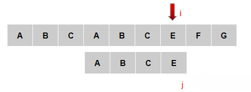

## 红黑树 

> Knuth-Morris-Pratt 字符串查找算法，简称为 “KMP算法”，常用于在一个文本串S内查找一个模式串P 的出现位置，这个算法由Donald Knuth、Vaughan Pratt、James H. Morris三人于1977年联合发表，故取这3人的姓氏命名此算法   

### 一般字符串匹配

最基础的匹配思路：

当匹配到如图第四个字符A位置后，匹配失败，子串回到第一个位置，主串后移，继续匹配

直到匹配成功

这种方式是效率最低，匹配次数最多的情况，接下来看KMP的解决思路

### KMP思想

KMP在遇到下图位置时，不会很无脑的把子串的j移动到第0位，主串的i移动到第1位，然后进行T[i]==P[j]的比较

KMP思想：利用前面匹配的信息，保持i指针不变，通过修改j指针，让子串尽量地移动到有效的位置。

先来看一下规律：

如图：C和D不匹配了，我们要把j移动到哪？显然是第1位。为什么？因为前面有一个A相同可以用

>红黑树的基本操作是添加、删除和旋转。在对红黑树进行添加或删除后，会用到旋转方法。为什么呢？道理很简单，添加或删除红黑树中的节点之后，红黑树就发生了变化，可能不满足红黑树的5条性质，也就不再是一颗红黑树了，而是一颗普通的树。而通过旋转，可以使这颗树重新成为红黑树。简单点说，旋转的目的是让树保持红黑树的特性。
旋转包括两种：左旋 和 右旋。下面分别对旋转(左旋和右旋)、添加、删除进行介绍。

### 红黑树的基本操作(一) 左旋和右旋

>仔细观察下面"左旋"和"右旋"的示意图。我们能清晰的发现，它们是对称的。无论是左旋还是右旋，被旋转的树，在旋转前是二叉查找树，并且旋转之后仍然是一颗二叉查找树。

对x进行左旋，意味着，将“x的右孩子”设为“x的父亲节点”；即，将 x变成了一个左节点(x成了为y的左孩子)！。 因此，左旋中的“左”，意味着“被旋转的节点将变成一个左节点”。

对y进行右旋，意味着，将“y的左孩子”设为“y的父亲节点”；即，将 y变成了一个右节点(y成了为x的右孩子)！ 因此，右旋中的“右”，意味着“被旋转的节点将变成一个右节点”。

### 红黑树的基本操作(二) 插入

将一个节点插入到红黑树中，需要执行哪些步骤呢？首先，将红黑树当作一颗二叉查找树，将节点插入；然后，将节点着色为红色；最后，通过旋转和重新着色等方法来修正该树，使之重新成为一颗红黑树。详细描述如下：

#### 第一步: 将红黑树当作一颗二叉查找树，将节点插入。
#### 第二步：将插入的节点着色为"红色"
#### 第三步: 通过一系列的旋转或着色等操作，使之重新成为一颗红黑树

 

