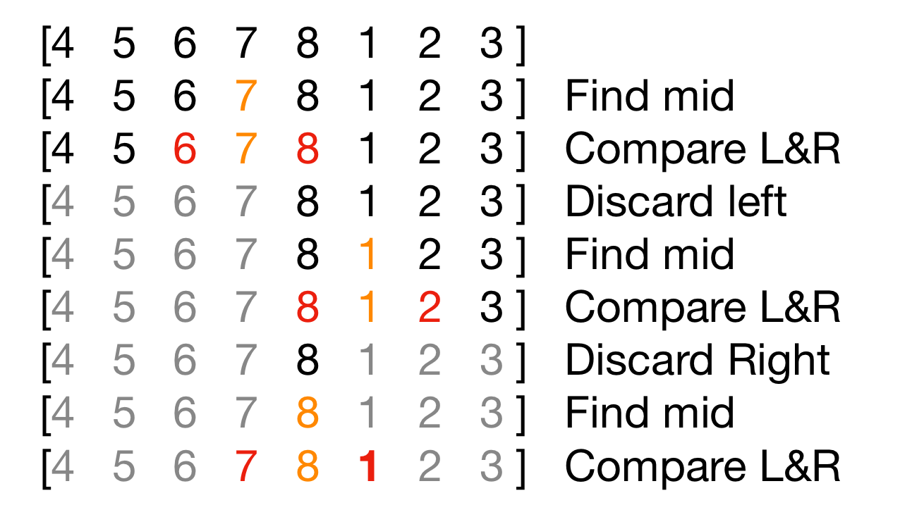

# Search in Rotated Sorted Array

# 原题： 

Suppose an array **sorted in ascending order** is rotated at some pivot unknown to you beforehand.
i.e.[0,1,2,4,5,6,7]might become[4,5,6,7,0,1,2]. 
You are given a target value to search. If found in the array return its index, otherwise return -1. 
**You may assume no duplicate exists in the array.** 
Your algorithm's runtime complexity must be in the order of **O(log(n))**.

## 示例：
Input [4,5,6,7,0,1,2,3] , target = 0
Output 4

Input [4,5,6,7,0,1,2,3] , target = 9
Output -1

### 算法流程

观察题目可以看到4个重要信息：
1、有序
2、旋转
3、不重复
4、O(log(n))


### 二分查找法

二分查找法主要是解决在“一堆数中找出指定的数”这类问题。

而想要应用二分查找法，这“一堆数”必须有以下特征：

1、存储在数组中
2、有序排列

所以如果是用链表存储的，就无法在其上应用二分查找法了。

至于是顺序递增排列还是递减排列，数组中是否存在相同的元素都不要紧。不过一般情况，我们还是希望并假设数组是递增排列，数组中的元素互不相同。

 
### 方案一

这里首先我们想一下变化前，正常的升序。我们怎么找给定的数字。


很简单是吧

但如果，数组在其中某一个点进行了旋转，该怎么办呢？

此时我们的数组变成下边这样：


因为题目要求时间复杂度是 O（log(n)），所以我们首先会想到采取二分的方法去找。

二分的方法就要保证**每次比较后，去掉一半的元素**

就无法直接使用二分查找了。

1、但我们可以想一下，如果我们能找到数组中**最小**的点
那么最小点**右边**的所有元素，是否都小于**最后**的元素？（也就是都小于上图中的end）
最小点**左边**的所有元素，是否都大于**最后**的元素？（如果最小点在最左边，则表明数组没有旋转）


2、之后，我们再看target（目标值）在哪一边(最小点的左边还是右边)，对其所在地方进行二分查找。

如果上述方案成立，那我们首先，要求出来整个数组中最小的元素（也可以说是**旋转点**）

如何找到最小元素（**旋转点**）呢？



4  5  6  7  8  1  2  3  首先找到中间元素【7】

由于数组是升序排列的，可以拿array[mid] -> 7和左右的元素比较
**假设7<左边的元素6，说明7是最小的元素（显然不是）**
**假设7>右边的元素8，说明8是最小的元素（显然不是）**

之后用【7】和**最左边**的元素【4】进行比较。发现7 > 4
说明左边是有序的，**舍弃左边**。
继续对右边数组取中位数进行查找。

8  1  2  3  找到中间元素【1】

左右比较，发现都正常。

之后用【1】和**最左边**的元素【8】进行比较。1 < 8
说明右边是有序的，舍弃右边。
继续对左边数组取中位数进行查找。

但是只剩下8一个元素了。
**假设8<左边的元素7，说明7是最小的元素（显然不是）**
**假设8>右边的元素1，说明1是最小的元素**

这道题已判断出结果，**【1】**是最小的元素

代码如下：

```objc
+ (NSInteger)findMinNumber:(NSArray<NSNumber *> *)array{
    if (array == nil || [array count] == 0) {
        return NSIntegerMin;
    }
    if ([array count] == 1) {
        return [[array firstObject] integerValue];
    }
    // initializing left and right pointers.
    NSInteger left = 0;
    NSInteger right = [array count] - 1;
    // if the last element is greater than the first element then there is no rotation.
    // e.g. 1 < 2 < 3 < 4 < 5 < 7. Already sorted array.
    // Hence the smallest element is first element. A[0]
    if (array[right].integerValue > array[0].integerValue) {
        return array[0].integerValue;
    }
    // Binary search way
    while (right >= left) {
        // Find the mid element
        NSInteger mid = left + (right - left) / 2;
        // if the mid element is greater than its next element then mid+1 element is the smallest
        // This point would be the point of change. From higher to lower value.
        if (array[mid].integerValue > array[mid + 1].integerValue) {
            return array[mid + 1].integerValue;
        }
        // if the mid element is lesser than its previous element then mid element is the smallest
        if (array[mid - 1].integerValue > array[mid].integerValue) {
            return array[mid].integerValue;
        }
        // if the mid elements value is greater than the 0th element this means
        // the least value is still somewhere to the right as we are still dealing with elements
        // greater than nums[0]
        if (array[mid].integerValue > array[0].integerValue) {
            left = mid + 1;
        } else {
            // if nums[0] is greater than the mid value then this means the smallest value is somewhere to
            // the left
            right = mid - 1;
        }
    }
    return -1;
}
```
获取到最小值后，再根据target和最小值和最右侧元素的比较，就判断出来target是在最小值的左边还是右边了。

由于上面已经解释，最小值左右均是有序数组，所以对target所在的半边数组，进行二分查找即可。

```objc

//二分方式
+ (NSInteger)searchInSortedArray1:(NSArray<NSNumber *> *)array target:(NSInteger)target{
    if ([array count] == 0) {
        return -1;
    }
    // initializing left and right pointers.
    NSInteger start = 0;
    NSInteger end = [array count] - 1;
    
    // -- 为了好讲，写了个算法获取最小值
    // -- 最后会换成直接操作start和end 
    NSInteger minNumber = [DDSearchInSortedArray findMinNumber:array];
    NSInteger minIndex = [array indexOfObject:@(minNumber)];
    if (minIndex == NSNotFound) {
        return -1;
    }
    //if the target is greater than min value , the target is in right array
    if (array[minIndex].integerValue <= target && target <= array[end].integerValue){
        start = minIndex;
    }else{
        end = minIndex;
    }
    //then Binary Search
    while (start <= end) {
        NSInteger mid = start + (end - start) / 2;
        if (array[mid].integerValue == target) {
            return mid;
        }else if (array[mid].integerValue > target) {
            end = mid - 1;
        }else{
            start = mid + 1;
        }
    }
    return -1;
}

```


### 方案二 （优化）

换个思路，该算法基于一个事实，数组从任意位置劈成两个数组后
至少有一半是有序的，什么意思呢？

比如 [ 4 5 6 7 0 1 2] ，从 7 劈开，左边是 [ 4 5 6 7] 右边是 [ 7 0 1 2]，左边是有序的。

比如 [ 12 15 20 2 5 7 9 11] ，从 2 劈开，左边是 [ 12 15 20 2 ] 右边是 [ 2 5 7 9 11 ]，右边是有序的。


基于这个事实。

我们可以先找到哪一段是有序的 (只要判断端点即可)
比如第一个例子：
左边的端点是：4 - 7 ，右边的端点是7 - 2，说明是左边是有序的，

然后看 target 在不在这一段（4 - 7）里 （target > left , target < right）
如果在，那么就把另一半丢弃。
如果不在，那么就把这一段（有序的这一段）丢弃

代码如下：

```objc

+ (NSInteger)searchInSortedArray2:(NSArray<NSNumber *> *)array target:(NSInteger)target{
    if ([array count] == 0) {
        return -1;
    }
    // initializing left and right pointers.
    NSInteger start = 0;
    NSInteger end = [array count] - 1;
    while (start <= end) {
        NSInteger mid = (start + end) / 2;
        if (target == array[mid].integerValue) {
            return mid;
        }
        //left is Sorted array
        if (array[start].integerValue <= array[mid].integerValue) {
            //target in this
            if (target >= array[start].integerValue && target < array[mid].integerValue) {
                end = mid - 1;
            } else {
                start = mid + 1;
            }
            //right is Sorted array
        } else {
            //target in this
            if (target > array[mid].integerValue && target <= array[end].integerValue) {
                start = mid + 1;
            } else {
                end = mid - 1;
            }
        }
        
    }
    return -1;
}
```

### 拓展（方案三）

由于数组不是单调递增
所以移动左（left）还是移动右（right）要分条件
不妨画一个流程图协助分析可能出现的情况。
作图省略对等号的判断
（因如果判断target的相等，直接可以返回该index）

如下所示：


#### 分析

已经有了对条件的梳理，我们可以得出一个结论

简要来说：

当：array[0] < array[mid]（0 - mid不包含旋转）
并且：array[0] < target < array[mid] （target在0-mid中间）时
移动右边（right -> mid）

当：array[mid] < array[0]（0 - mid包含旋转）
target < array[mid] < array[0] （target在0-mid中间，但在旋转点右侧）时
移动右边（right -> mid）

当：array[mid] < array[0]（0 - mid包含旋转）
array[mid] < array[0] < target 时 （target在0-mid中间，但在旋转点左侧）
移动右边（right -> mid）

其他情况移动左边。

把上述移动右边的组合排除后，也就是说如下条件中：
array[0] > array[mid]
array[0] > target 
target > array[mid] 
三项均为真或者只有一项为真时，**移动左点**，否则**移动右点**。

可以想到用异或来判断逻辑(当然也可以按照上面写if else)

之后我们通过二分查找不断做小 target 可能位于的区间
直到 left==right，此时如果 array[left]==target 则找到了，如果不等则说明该数组里没有此项。

代码如下：

```objc
+ (NSInteger)searchInSortedArray4:(NSArray<NSNumber *> *)array target:(NSInteger)target{
    if ([array count] == 0) {
        return -1;
    }
    NSInteger location = 0;
    NSInteger length = [array count] - 1;
    while (location < length) {
        NSInteger middle = (location + length) / 2;
        if ((array[0].integerValue > target) ^ (array[0].integerValue > array[middle].integerValue) ^ (target > array[middle].integerValue)){
            location = middle + 1;
        }else {
            length = middle;
        }
    }
    return (location == length && (array[location].integerValue == target)) ? location : -1;
}

```

### 总结

三种解法的本质都是二分查找，找到丢弃一半的规则，
从而达到 log（n）的时间复杂度.


### 拓展2

A：如果数组中包含重复元素，需要找到第一个符合的index呢？
B：如果数组进行过n次旋转？应该怎么解呢？
