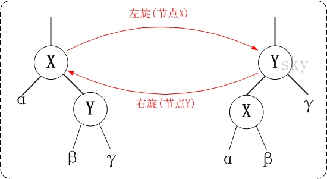
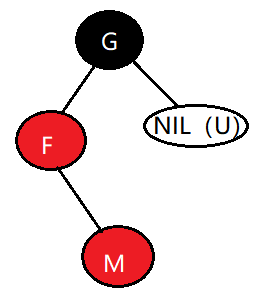
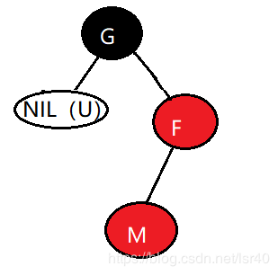
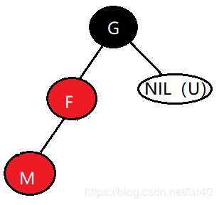
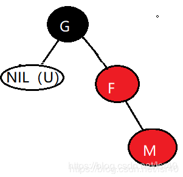
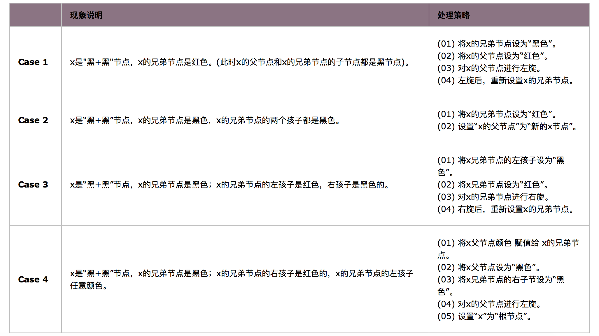

## 红黑树 

> 红黑树，一种二叉查找树，但在每个结点上增加一个存储位表示结点的颜色，可以是Red或Black。
通过对任何一条从根到叶子的路径上各个结点着色方式的限制，红黑树确保没有一条路径会比其他路径长出俩倍，因而是接近平衡的，红黑树，作为一棵二叉查找树，满足二叉查找树的一般性质：      
1、若任意节点的左子树不空，则左子树上所有结点的值均小于它的根结点的值；     
2、若任意节点的右子树不空，则右子树上所有结点的值均大于它的根结点的值；   
3、任意节点的左、右子树也分别为二叉查找树。   
4、没有键值相等的节点（no duplicate nodes）。   

### 红黑树的特性
1、 每个节点或者是黑色，或者是红色。         
2、根节点是黑色。     
3、每个叶子节点是黑色。 [注意：这里叶子节点，是指为空的叶子节点！]         
4、 如果一个节点是红色的，则它的子节点必须是黑色的。         
5、从一个节点到该节点的子孙节点的所有路径上包含相同数目的黑节点。             

红黑树示意图如下：

### 红黑树的基本实现

>红黑树的基本操作是添加、删除和旋转。在对红黑树进行添加或删除后，会用到旋转方法。为什么呢？道理很简单，添加或删除红黑树中的节点之后，红黑树就发生了变化，可能不满足红黑树的5条性质，也就不再是一颗红黑树了，而是一颗普通的树。而通过旋转，可以使这颗树重新成为红黑树。简单点说，旋转的目的是让树保持红黑树的特性。
旋转包括两种：左旋 和 右旋。下面分别对旋转(左旋和右旋)、添加、删除进行介绍。

### 红黑树的基本操作(一) 左旋和右旋

>仔细观察下面"左旋"和"右旋"的示意图。我们能清晰的发现，它们是对称的。无论是左旋还是右旋，被旋转的树，在旋转前是二叉查找树，并且旋转之后仍然是一颗二叉查找树。

对x进行左旋，意味着，将“x的右孩子”设为“x的父亲节点”；即，将 x变成了一个左节点(x成了为y的左孩子)！。 因此，左旋中的“左”，意味着“被旋转的节点将变成一个左节点”。

对y进行右旋，意味着，将“y的左孩子”设为“y的父亲节点”；即，将 y变成了一个右节点(y成了为x的右孩子)！ 因此，右旋中的“右”，意味着“被旋转的节点将变成一个右节点”。

### 红黑树的基本操作(二) 插入

将一个节点插入到红黑树中，需要执行哪些步骤呢？首先，将红黑树当作一颗二叉查找树，将节点插入；然后，将节点着色为红色；最后，通过旋转和重新着色等方法来修正该树，使之重新成为一颗红黑树。详细描述如下：

#### 第一步: 将红黑树当作一颗二叉查找树，将节点插入。
#### 第二步：将插入的节点着色为"红色"
#### 第三步: 通过一系列的旋转或着色等操作，使之重新成为一颗红黑树

### 红黑数插入的几种情况

1、被插入的节点是根节点。        
处理方法：直接把此节点涂为黑色。  
2、 被插入的节点的父节点是黑色。        
处理方法：什么也不需要做。节点被插入后，仍然是红黑树。         
3、被插入的节点的父节点是红色。                 
处理方法：那么，该情况与红黑树的“特性(5)”相冲突。这种情况下，被插入节点是一定存在非空祖父节点的；进一步的讲，被插入节点也一定存在叔叔节点(即使叔叔节点为空，我们也视之为存在，空节点本身就是黑色节点)。理解这点之后，我们依据"叔叔节点的情况"，将这种情况进一步划分为3种情况(Case)。 

#### Case 1    当前节点的父节点是红色，且当前节点的祖父节点的另一个子节点（叔叔节点）也是红色。    
(01) 将“父节点”设为黑色。  
(02) 将“叔叔节点”设为黑色。  
(03) 将“祖父节点”设为“红色”。  
(04) 将“祖父节点”设为“当前节点”(红色节点)；即，之后继续对“当前节点”进行操作。  

所以红黑树由之前的：    
      

变化成： 
   

#### Case 2    当前节点的父节点是红色，叔叔节点是黑色，且当前节点是其父节点的右孩子    
(01) 将“父节点”作为“新的当前节点”。          
(02) 以“新的当前节点”为支点进行左旋。            

所以红黑树由之前的：      
     

变化成： 
   

#### Case 3    当前节点的父节点是红色，叔叔节点是黑色，且当前节点是其父节点的左孩子    
(01) 将“父节点”设为“黑色”。              
(02) 将“祖父节点”设为“红色”。             
(03) 以“祖父节点”为支点进行右旋。          

所以红黑树由之前的：    
     

变化成：    
   

#### 再来看一下下面的这组图

                                 

                                 

这里需要特别注意的是图1和图2都是属于Case2的情况，图3和图4都是属于Case3的情况

### 红黑树的基本操作(三) 删除

将红黑树内的某一个节点删除。需要执行的操作依次是：首先，将红黑树当作一颗二叉查找树，将该节点从二叉查找树中删除；然后，通过"旋转和重新着色"等一系列来修正该树，使之重新成为一棵红黑树。详细描述如下：

第一步：将红黑树当作一颗二叉查找树，将节点删除。
这和"删除常规二叉查找树中删除节点的方法是一样的"。分3种情况：    
① 被删除节点没有儿子，即为叶节点。那么，直接将该节点删除就OK了。          
② 被删除节点只有一个儿子。那么，直接删除该节点，并用该节点的唯一子节点顶替它的位置。         
③ 被删除节点有两个儿子。那么，先找出它的后继节点；我们可以选择左儿子中的最大元素或者右儿子中的最小元素作为后继节点，就可以保证满足搜索二叉树的结构 ,然后把“它的后继节点的内容”复制给“该节点的内容”；之后，删除“它的后继节点”。在这里，后继节点相当于替身，在将后继节点的内容复制给"被删除节点"之后，再将后继节点删除。这样就巧妙的将问题转换为"删除后继节点"的情况了，下面就考虑后继节点。 在"被删除节点"有两个非空子节点的情况下，它的后继节点不可能是双子非空。既然"的后继节点"不可能双子都非空，就意味着"该节点的后继节点"要么没有儿子，要么只有一个儿子。若没有儿子，则按"情况① "进行处理；若只有一个儿子，则按"情况② "进行处理。

第二步：通过"旋转和重新着色"等一系列来修正该树，使之重新成为一棵红黑树。
因为"第一步"中删除节点之后，可能会违背红黑树的特性。所以需要通过"旋转和重新着色"来修正该树，使之重新成为一棵红黑树。

前面我们将"删除红黑树中的节点"大致分为两步，在第一步中"将红黑树当作一颗二叉查找树，将节点删除"后，可能违反"特性(2)、(4)、(5)"三个特性。第二步需要解决上面的三个问题，进而保持红黑树的全部特性。
为了便于分析，我们假设"x包含一个额外的黑色"(x原本的颜色还存在)，这样就不会违反"特性(5)"。为什么呢？
通过RB-DELETE算法，我们知道：删除节点y之后，x占据了原来节点y的位置。 既然删除y(y是黑色)，意味着减少一个黑色节点；那么，再在该位置上增加一个黑色即可。这样，当我们假设"x包含一个额外的黑色"，就正好弥补了"删除y所丢失的黑色节点"，也就不会违反"特性(5)"。 因此，假设"x包含一个额外的黑色"(x原本的颜色还存在)，这样就不会违反"特性(5)"。
现在，x不仅包含它原本的颜色属性，x还包含一个额外的黑色。即x的颜色属性是"红+黑"或"黑+黑"，它违反了"特性(1)"。

现在，我们面临的问题，由解决"违反了特性(2)、(4)、(5)三个特性"转换成了"解决违反特性(1)、(2)、(4)三个特性"

#### 红黑数删除修复的几种情况：        
① 情况说明：x是“红+黑”节点。          
处理方法：直接把x设为黑色，结束。此时红黑树性质全部恢复。            
② 情况说明：x是“黑+黑”节点，且x是根。            
处理方法：什么都不做，结束。此时红黑树性质全部恢复。           
③ 情况说明：x是“黑+黑”节点，且x不是根。             
处理方法：这种情况又可以划分为4种子情况。这4种子情况如下表所示：                      

   
