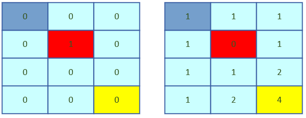
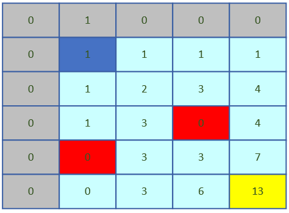
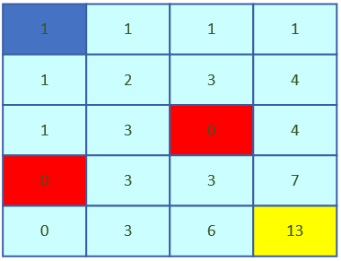

### 一、不同路径I（Unique Paths I）
一个机器人位于一个**m x n**网格的左上角（起始点在下图中标记为“Start”）。

机器人每次只能**向下**或者**向右**移动一步。机器人试图达到网格的右下角（在下图中标记为“Finish”）。

问总共有多少条**不同的路径**？


例如，上图是一个7 x 3的网格。有多少可能的路径？

**说明：**m 和 n 的值均不超过**100**。

**示例 1:**

> 输入: m = 3, n = 2

> 输出: 3

> 解释:

> 从左上角开始，总共有3条路径可以到达右下角。

> 1.向右 -> 向右 -> 向下

> 2.向右 -> 向下 -> 向右

> 3.向下 -> 向右 -> 向右

**示例 2:**

> 输入: m = 7, n = 3

> 输出: 28

**示例 3:**


> 输入: m = 2, n = 2

> 输出: 2

> 解释:

> 从左上角开始，总共有2条路径可以到达右下角。

> 1.向右 -> 向下

> 2.向下 -> 向右

### 二、不同路径II（Unique Paths II）

#### 1.如何理解这题目？

1）不同路径，只要经过的路径有一个节点不一样，则认为是不同路径；这个不同路径的数量，要明确不是求最大值，而是所有不同路径数量的总和。

2）首先我们会想到用递归去解决这个问题，从网格的右下角（“Finish”）往前面递归，直到左上角（“Start”）位置。

3）其次不难发现，这是典型的动态规划题目，不难从题目中得到状态转移方程（在接下来介绍）。

4）下面再看例子



> 上图中，这个4 x 3的网格，中间只有一个障碍节点；不难从右边表格数出，从左上角到右下角到不同路径数量为**4**；


> 上图中，这个5 x 4的网格，中间有两个障碍节点；



> 上图是前面5 x 4网格的详细不同数量，新建一个新的网络extend_grid存储该节点的不同路径数量，行数为m + 1，列数为n + 1；

> 然后定义extend_grid[0][1] = 1，或者extend_grid[1][0] = 1；

> 可以看出它的不同路径数量为**13**。



> 上图的解法，没有新建extend_grid存储不同路径数量，而是从左上角至右下角依次修改原有网格的值，最后grid[m - 1][n - 1]即为所求的不同路径数量。

#### 2.确定边界
> m和n的限制，从题目中看到m和n不大于100，从前面理解题目意思看出，这里面的不同路径数量肯定会收到常规数值类型的表示范围，所以应该考虑用字符串表示路径数量。

#### 3.递归终止条件
> 1）遇到障碍
```C++
if (obstacle_grid[i][j] == StaticObstacleString()) {
    return std::to_string(0);
}
```

> 2）在起始点（“Start”）终止
```C++
if (i == 0 && j == 0) {
    if (obstacle_grid[i][j] == StaticObstacleString()) {
        return std::to_string(0);
    } else {
        return std::to_string(1);
    }
}
```

> 3）上边界
```C++
if (i == 0 && j >= 1) {
    return RecursiveUniquePathsII<m, n>(obstacle_grid, i, j -1);
}
```

> 4）左边界
```C++
if (i >= 1 && j == 0) {
    return RecursiveUniquePathsII<m, n>(obstacle_grid, i - 1, j);
}
```

> 5）其他情况递归
```C++
std::string dp1 = RecursiveUniquePathsII<m, n>(obstacle_grid, i - 1, j);
std::string dp2 = RecursiveUniquePathsII<m, n>(obstacle_grid, i, j - 1);
return future_base::BigInegerAdd(dp1, dp2);
```

#### 4.状态转移方程

> 1）起始点


> 2）上边界


> 3）左边界


> 4）剩余情况


### 三、代码实现

#### 1.随机生成二维数组
```C++
static const int kLimitGridCount = 100;

//随机障碍比例
static const float kRandomObstaclePercent = 0.1;

template <int m, int n>
std::string **MakeObstacleGrid() {
    static_assert(m > 0 && m <= kLimitGridCount, "m must > 0 and <= 100");
    static_assert(n > 0 && n <= kLimitGridCount, "n must > 0 and <= 100");
    
    std::string **obstacle_grid = new std::string*[m];
    
    for (int i = 0; i < m; ++i) {
        obstacle_grid[i] = new std::string[n];
        
        int random_count = (int)(n * kRandomObstaclePercent);
        
        for (int j = 0; j < n; ++j) {
            obstacle_grid[i][j] = "0";
        }
        
        for (int j = 0; j < random_count; ++j) {
            obstacle_grid[i][arc4random() % n] = StaticObstacleString();
        }
    }
    
    obstacle_grid[0][0] = std::to_string(0);
    obstacle_grid[m - 1][n - 1] = std::to_string(0);
    
    return obstacle_grid;
}
```

#### 2.递归实现
```C++
template <int m, int n>
std::string RecursiveUniquePathII(std::string **obstacle_grid, int i, int j) {
    if (obstacle_grid == NULL) {
        return std::to_string(0);
    }
    
    if (obstacle_grid[i][j] == StaticObstacleString()) {
        return std::to_string(0);
    }
    
    if (i == 0 && j == 0) {
        if (obstacle_grid[i][j] == StaticObstacleString()) {
            return std::to_string(0);
        } else {
            return std::to_string(1);
        }
    }
    
    if (i == 0 && j >= 1) {
        return RecursiveUniquePathsII<m, n>(obstacle_grid, i, j -1);
    }
    
    if (i >= 1 && j == 0) {
        return RecursiveUniquePathsII<m, n>(obstacle_grid, i - 1, j);
    }
    
    std::string dp1 = RecursiveUniquePathsII<m, n>(obstacle_grid, i - 1, j);
    std::string dp2 = RecursiveUniquePathsII<m, n>(obstacle_grid, i, j - 1);
    return future_base::BigInegerAdd(dp1, dp2);
}
```
> 注意：在m = 30，n = 30时候，递归实现几乎就很难执行完毕。

#### 3.DP实现（增加二维数组）
```C++
template <int m, int n>
std::string UniquePathsII(std::string **obstacle_grid) {
    std::string unique_path_count = StaticInvalidCount();
    
    if (m <= 0 || n <= 0) {
        return unique_path_count;
    }
    
    if (m > kLimitGridCount || n > kLimitGridCount) {
        return unique_path_count;
    }
        
    std::vector<std::vector<std::string> > result_count_array(m + 1, std::vector<std::string>(n + 1, "0"));

    result_count_array[0][1] = std::to_string(1);

    for (size_t i = 1; i <= m; ++i) {
        for (size_t j = 1; j <= n; ++j) {
            if (obstacle_grid[i - 1][j - 1] == StaticObstacleString()) {
                continue;
            }
            
            result_count_array[i][j] = future_base::BigInegerAdd(result_count_array[i - 1][j],
                                                                    result_count_array[i][j - 1]);
        }
    }

    unique_path_count = result_count_array[m][n];

    return unique_path_count;
}
```

#### 4.DP实现（修改参数二维数组）
```C++
template <int m, int n>
std::string UniquePathsII(std::string **obstacle_grid) {
    std::string unique_path_count = StaticInvalidCount();
    
    if (m <= 0 || n <= 0) {
        return unique_path_count;
    }
    
    if (m > kLimitGridCount || n > kLimitGridCount) {
        return unique_path_count;
    }

    for (size_t i = 0; i < m; ++i) {
        for (size_t j = 0; j < n; ++j) {
            if (obstacle_grid[i][j] == StaticObstacleString()) {
                obstacle_grid[i][j] = std::to_string(0);
                continue;
            } else if (i == 0 && j == 0) {
                obstacle_grid[0][0] = std::to_string(1); //如果开始不是障碍，则路径为1
                continue;
            }

            if (i == 0) {
                obstacle_grid[i][j] = obstacle_grid[i][j - 1];
            } else if (j == 0) {
                obstacle_grid[i][j] = obstacle_grid[i - 1][j];
            } else {
                obstacle_grid[i][j] = future_base::BigInegerAdd(obstacle_grid[i - 1][j],
                                                                obstacle_grid[i][j - 1]);
            }
        }
    }

    unique_path_count = obstacle_grid[m - 1][n - 1];
    return unique_path_count;
}
```

#### 5.DP实现（修改参数二维数组、优化）
```C++
template <int m, int n>
std::string UniquePathsII(std::string **obstacle_grid) {
    std::string unique_path_count = StaticInvalidCount();
    
    if (m <= 0 || n <= 0) {
        return unique_path_count;
    }
    
    if (m > kLimitGridCount || n > kLimitGridCount) {
        return unique_path_count;
    }

    if (obstacle_grid[0][0] == StaticObstacleString()) {
        return std::to_string(0);
    } else {
        obstacle_grid[0][0] = std::to_string(1); //起始位置如果开始不是障碍，则路径数为1
    }
    
    for (size_t j = 1; j < n; ++j) {
        if (obstacle_grid[0][j] == StaticObstacleString()) {
            obstacle_grid[0][j] =  std::to_string(0);
            continue;
        }
        obstacle_grid[0][j] = obstacle_grid[0][j - 1];
    }
    
    for (size_t i = 1; i < m; ++i) {
        if (obstacle_grid[i][0] == StaticObstacleString()) {
            obstacle_grid[i][0] = std::to_string(0);
            continue;
        }
        obstacle_grid[i][0] = obstacle_grid[i - 1][0];
    }
    
    for (size_t i = 1; i < m; ++i) {
        for (size_t j = 1; j < n; ++j) {
            if (obstacle_grid[i][j] == StaticObstacleString()) {
                obstacle_grid[i][j] = std::to_string(0);
                continue;
            }
            
            obstacle_grid[i][j] = future_base::BigInegerAdd(obstacle_grid[i - 1][j],
                                                            obstacle_grid[i][j - 1]);
        }
    }
    unique_path_count = obstacle_grid[m - 1][n - 1];
    
    return unique_path_count;
}
```

#### 6.算法复杂度O(m * n)

### 四、思考
> 1.为什么要限制网络m和n不大于100？

> 2.现在距离1970年走过的秒数是多少？32bit的整数还能表示多少年？

> 3.扩展与思考：固定的不同路径数量，最少需要多少个障碍？

> 4.应用场景？


### 五、参考资料
> 1.[LeetCode不同路径I](https://leetcode-cn.com/problems/unique-paths/)

> 2.[LeetCode不同路径II](https://leetcode-cn.com/problems/unique-paths-ii/)

> 3.[博客园](https://www.cnblogs.com/grandyang/p/4353680.html)

> 4.[大数加减法](https://blog.csdn.net/xiaozhuaixifu/article/details/38318489)


### 六、版权声明
> 1.本文章算法来源：力扣（LeetCode）

> 2.本文章仅限学习算法与交流，著作权归领扣网络所有。商业转载请联系官方授权，非商业转载请注明出处。

